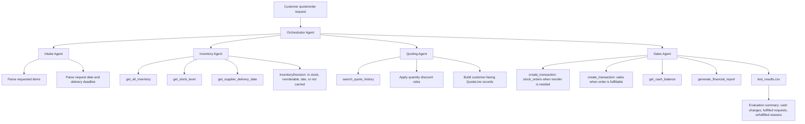

# Beaver's Choice Multi-Agent Workflow Diagram

This diagram describes the submitted multi-agent architecture. The runnable evaluation path is deterministic for reliability, while `framework_agents.py` documents the optional PydanticAI bindings for the same agents and tools.

## Agent responsibilities

### Orchestrator Agent

The Orchestrator Agent coordinates the workflow. It receives each customer request, delegates parsing to the Intake Agent, sends structured line items to the Inventory Agent, sends fulfillable inventory decisions to the Quoting Agent, and asks the Sales Agent to record only fully fulfillable firm orders.

### Intake Agent

The Intake Agent extracts structured `RequestItem` records from natural-language requests and identifies the requested delivery deadline. It does not check inventory, generate prices, or record transactions.

### Inventory Agent

The Inventory Agent checks stock and decides whether missing stock can be reordered in time. It uses:

- `get_all_inventory` to inspect available inventory;
- `get_stock_level` to check one item;
- `get_supplier_delivery_date` to decide whether reorder can meet the customer's requested delivery date.

### Quoting Agent

The Quoting Agent calculates customer-facing prices, applies bulk discounts, and builds quote lines. It uses `search_quote_history` as a historical pricing/context tool and keeps pricing logic separate from inventory mutation.

### Sales Agent

The Sales Agent records transactions only after the Orchestrator confirms the request is a firm order and all requested catalog items can be fulfilled. It uses:

- `create_transaction` for restocks and sales;
- `get_cash_balance` to confirm cash changes;
- `generate_financial_report` to report updated business state.

## Data flow

1. Customer request enters the Orchestrator.
2. Intake Agent converts the request into structured line items.
3. Inventory Agent checks current stock and reorder feasibility.
4. Quoting Agent calculates customer-facing quote lines.
5. Sales Agent records transactions for fully fulfillable firm orders.
6. The final response and financial state are written to `test_results.csv`.
