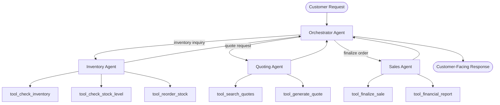

```mermaid
flowchart TD
    Customer([Customer Request]) --> Orch[Orchestrator Agent]
    Orch -->|inventory inquiry| Inv[Inventory Agent]
    Orch -->|quote request| Quote[Quoting Agent]
    Orch -->|finalize order| Sales[Sales Agent]
    Inv --> tool_check_inventory
    Inv --> tool_check_stock_level
    Inv --> tool_reorder_stock
    Quote --> tool_search_quotes
    Quote --> tool_generate_quote
    Sales --> tool_finalize_sale
    Sales --> tool_financial_report
    Inv --> Orch
    Quote --> Orch
    Sales --> Orch
    Orch --> Response([Customer-Facing Response])
```
