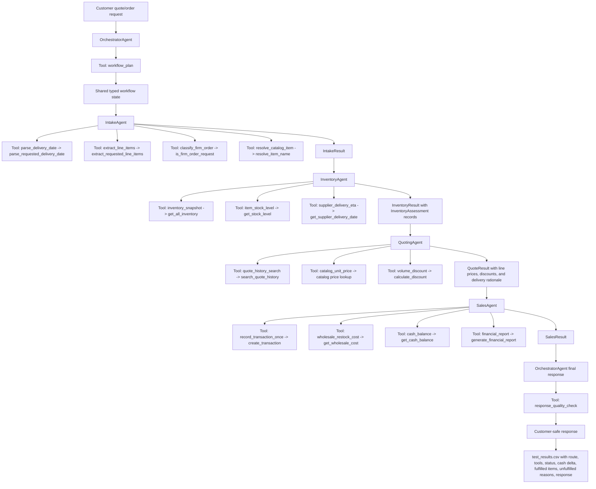

# Beaver's Choice PydanticAI Multi-Agent Workflow

The submitted workflow uses the selected `pydantic-ai` framework in the runnable `project_starter_update.py` path. The architecture stays within the five-agent project limit by using `OrchestratorAgent`, `IntakeAgent`, `InventoryAgent`, `QuotingAgent`, and `SalesAgent`. Evaluation is handled by an Orchestrator-owned tool rather than by a sixth agent.

## Agent Responsibilities

### OrchestratorAgent

The OrchestratorAgent owns the request lifecycle and framework-level coordination. It creates a workflow plan, delegates to the worker agents, synthesizes the final customer response, and uses its `response_quality_check` tool as the final evaluation gate. It does not perform inventory math, quote math, or direct transaction mutation.

### IntakeAgent

The IntakeAgent owns structured request extraction. Its tools parse requested delivery date, extract requested line items, classify whether the request is a firm order, and resolve raw item phrases to catalog item names.

### InventoryAgent

The InventoryAgent owns stock and delivery feasibility. It is read-only except for its structured `InventoryResult`. Its tools are `inventory_snapshot`, `item_stock_level`, and `supplier_delivery_eta`, which call the starter helpers `get_all_inventory`, `get_stock_level`, and `get_supplier_delivery_date`.

### QuotingAgent

The QuotingAgent owns price construction and historical quote context. Its tools call `search_quote_history`, catalog unit-price lookup, and the discount calculator. It does not update inventory or record sales.

### SalesAgent

The SalesAgent is the only worker allowed to mutate business state. It records restock and sale transactions only when the order is firm and fully fulfillable. Its tools call `create_transaction`, `get_cash_balance`, and `generate_financial_report`, with `record_transaction_once` used to reduce duplicate transaction risk.

## Data Flow

1. The OrchestratorAgent receives a customer request and creates a route plan.
2. The IntakeAgent converts raw text into typed request state.
3. The InventoryAgent checks current stock and supplier delivery timing.
4. The QuotingAgent prices fulfillable items and applies quantity discounts.
5. The SalesAgent records transactions only for firm, fully fulfillable orders.
6. The OrchestratorAgent writes and evaluates the customer-facing response.
7. The workflow writes `test_results.csv` with the agent route, tool-call audit, order status, cash deltas, fulfilled items, unfulfilled reasons, evaluation result, and response.
